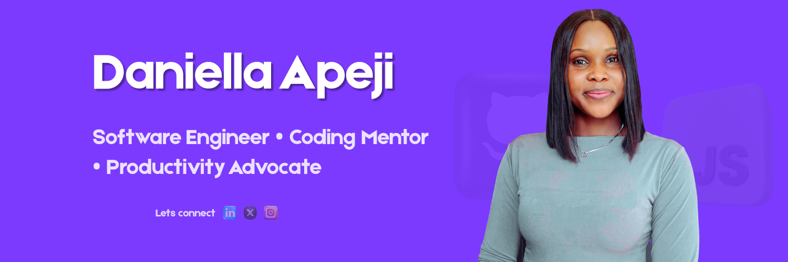

I'm an aspiring Front-End Developer passionate about crafting user-centered designs that are not just visually appealing but also functional and accessible.
With a background in Electrical and Electronics Engineering, I graduated among the top 5 students in my department — a reflection of my strong work ethic, dedication, and problem-solving mindset. 

I’m currently focused on learning and building with HTML, CSS, and JavaScript, and gradually transitioning into more advanced front-end technologies. I’m deeply passionate about creating intuitive, responsive, and accessible user interfaces that improve people's experience on the web.
I thrive on solving real-world problems and enjoy turning complex ideas into simple, elegant web experiences. My goal? To build meaningful solutions, help others stay productive, and continuously grow — one line of code at a time.


## Tech Stack:
           

## GitHub Stats:
<br/>
<br/>


<!-- Proudly created with GPRM ( https://gprm.itsvg.in ) -->

<!--START_SECTION:waka-->


**🐱 My GitHub Data** 

> 📦 2.4 kB Used in GitHub's Storage 
 > 
> 🚫 Not Opted to Hire
 > 
> 📜 6 Public Repositories 
 > 
> 🔑 0 Private Repositories 
 > 
**I'm a Night 🦉** 

```text
🌞 Morning                2 commits           █░░░░░░░░░░░░░░░░░░░░░░░░   04.44 % 
🌆 Daytime                9 commits           █████░░░░░░░░░░░░░░░░░░░░   20.00 % 
🌃 Evening                20 commits          ███████████░░░░░░░░░░░░░░   44.44 % 
🌙 Night                  14 commits          ████████░░░░░░░░░░░░░░░░░   31.11 % 
```
📅 **I'm Most Productive on Saturday** 

```text
Monday                   0 commits           ░░░░░░░░░░░░░░░░░░░░░░░░░   00.00 % 
Tuesday                  6 commits           ███░░░░░░░░░░░░░░░░░░░░░░   13.33 % 
Wednesday                9 commits           █████░░░░░░░░░░░░░░░░░░░░   20.00 % 
Thursday                 9 commits           █████░░░░░░░░░░░░░░░░░░░░   20.00 % 
Friday                   0 commits           ░░░░░░░░░░░░░░░░░░░░░░░░░   00.00 % 
Saturday                 14 commits          ████████░░░░░░░░░░░░░░░░░   31.11 % 
Sunday                   7 commits           ████░░░░░░░░░░░░░░░░░░░░░   15.56 % 
```


📊 **This Week I Spent My Time On** 

```text
🕑︎ Time Zone: Europe/London

💬 Programming Languages: 
HTML                     2 hrs 48 mins       ███████████████████████░░   93.97 % 
JavaScript               6 mins              █░░░░░░░░░░░░░░░░░░░░░░░░   03.87 % 
Git                      3 mins              █░░░░░░░░░░░░░░░░░░░░░░░░   02.16 % 

🔥 Editors: 
VS Code                  2 hrs 58 mins       █████████████████████████   100.00 % 

🐱‍💻 Projects: 
html_basic               1 hr 36 mins        █████████████░░░░░░░░░░░░   53.71 % 
My_First_Portfolio       1 hr 7 mins         █████████░░░░░░░░░░░░░░░░   37.78 % 
JS-Fundamentals          6 mins              █░░░░░░░░░░░░░░░░░░░░░░░░   03.87 % 
portfolio                4 mins              █░░░░░░░░░░░░░░░░░░░░░░░░   02.33 % 
development folder       4 mins              █░░░░░░░░░░░░░░░░░░░░░░░░   02.31 % 

💻 Operating System: 
Windows                  2 hrs 58 mins       █████████████████████████   100.00 % 
```

**I Mostly Code in HTML** 

```text
HTML                     2 repos             █████████████████░░░░░░░░   66.67 % 
JavaScript               1 repo              ████████░░░░░░░░░░░░░░░░░   33.33 % 
```


**Timeline**


 Last Updated on 22/07/2025 18:53:56 UTC
<!--END_SECTION:waka-->
